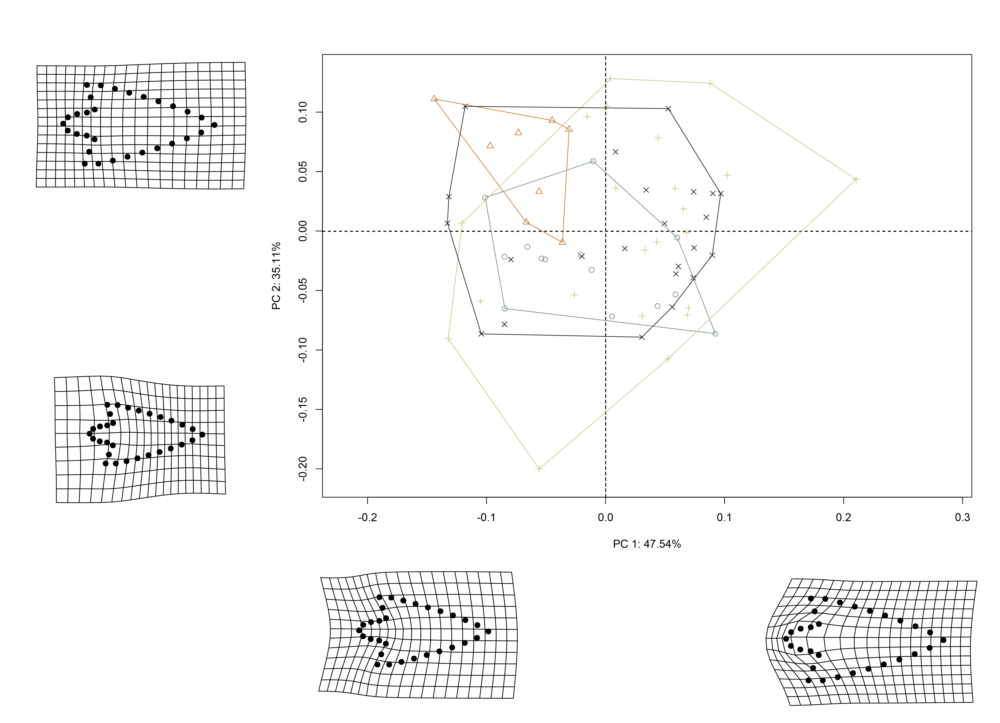
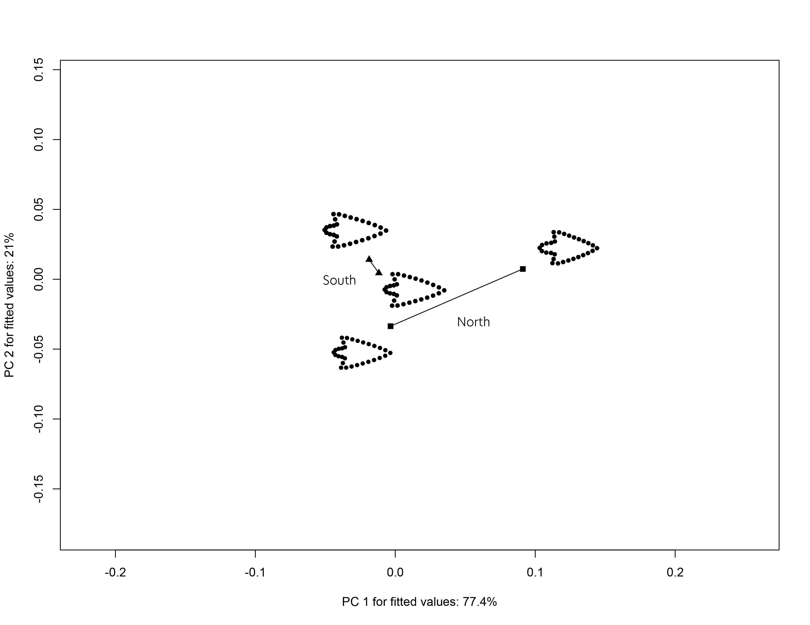

# Geometric morphometrics

Two `size classes` (large/small) were used to examine whether the morphology of Perdiz arrow points from the northern and southern behavioural regions in the ancestral Caddo region remain morphologically stable, or express morphological variation. Variability in Perdiz arrow point shape potentially provides evidence associated with differential resharpening trajectories.

This analysis follows recent analyses of Perdiz arrow points ([Selden and Dockall, in review](https://github.com/seldenlab/perdiz3/blob/main/ms/perdiz3/perdiz3.pdf)) and Gahagan biface morphology across the southern Caddo area and central Texas [@RN11783;@RN21001], where Perdiz arrow points and Gahagan bifaces have been found to differ in shape across the same geography as Caddo bottles [@RN11801;@RN11782;@RN11716;@RN8312].

It also follows another geometric morphometric analysis in which Perdiz arrow points from the ancestral Caddo area were found to differ as a function of _time_, _raw material_, and _burial context_ [@RN9551].

## Load packages + data

```{r load, echo=TRUE, warning=FALSE}
# load analysis packages
library(here)
library(StereoMorph)
library(geomorph)
library(ggplot2)
library(dplyr)
library(ggpubr)
library(wesanderson)

# read shape data and define number of sLMs
shapes <- readShapes("shapes")
shapesGM <- readland.shapes(shapes, 
                            nCurvePts = c(10,3,5,5,3,10))

# read qualitative data
qdata <- read.csv("qdata.morph.csv",
                  header = TRUE,
                  row.names = 1)
```

## Generalised Procrustes Analysis

Landmark data were aligned to a global coordinate system [@RN11622;@RN11623;@RN11563], achieved through generalized Procrustes superimposition [@RN478] performed in R 4.1.3 [@R] using the `geomorph` library v. 4.0.3 [@RN11530;@RN1774;@RN9565]. Procrustes superimposition translates, scales, and rotates the coordinate data to allow for comparisons among objects [@RN11564;@RN478]. The `geomorph` package uses a partial Procrustes superimposition that projects the aligned specimens into tangent space subsequent to alignment in preparation for the use of multivariate methods that assume linear space [@RN1646;@RN11563]. 

```{r gpa, echo=TRUE, out.width = "100%", dpi = 300, warning=FALSE}
# gpa
Y.gpa <- gpagen(shapesGM, print.progress = FALSE)

## plot
plot(Y.gpa)

# dataframe
gdf <- geomorph.data.frame(shape = Y.gpa$coords,
                           size = Y.gpa$Csize,
                           merged = qdata$merged)

# add centroid size to qdata
qdata$csz <- Y.gpa$Csize
```

## Boxplot (centroid size)

```{r box, echo=TRUE, out.width = "100%", dpi = 300, warning=FALSE}
# attributes
csz <- qdata$csz
merged <- qdata$merged

# palette
pal <- wes_palette("Moonrise2", 4, type = "continuous")

# boxplot of Perdiz arrow points by merged
ggplot(qdata, aes(x = merged, y = csz, color = merged)) +
  geom_boxplot() +
  geom_dotplot(binaxis = 'y', stackdir = 'center', dotsize = 0.3) +
  scale_color_manual(values = pal) +
  theme(legend.position = "none") +
  labs(x = 'Size Class', y = 'Centroid Size')
```

## Principal Components Analysis

Principal components analysis [@RN1746] was used to visualise shape variation among the Perdiz arrow points. The shape changes described by each principal axis are commonly visualized using thin-plate spline warping of a reference 3D mesh [@RN1731;@RN479].

```{r pcagm, echo=TRUE, out.width = "100%", dpi = 300, warning=FALSE}
# pca
pca <- gm.prcomp(Y.gpa$coords)
summary(pca)

# set plot parameters
pch.gps <- c(1:4)[as.factor(merged)]
col.gps <- pal[as.factor(merged)]
col.hull <- c("#798E87", "#C27D38", "#CCC591", "#29211F")

## pca plot
pc.plot <- plot(pca,
                asp = 1,
                pch = pch.gps,
                col = col.gps)
shapeHulls(pc.plot,
           groups = merged,
           group.cols = col.hull)
```

### Minima/maxima of PC1/2 with warp grids

```{r min.max, echo=TRUE, out.width = "100%", dpi = 300, warning=FALSE}
# plot x/y maxima/minima
## x - minima
mean.shape <- mshape(Y.gpa$coords)
plotRefToTarget(pca$shapes$shapes.comp1$min, 
                mean.shape)

## x - maxima
plotRefToTarget(pca$shapes$shapes.comp1$max, 
                mean.shape)

## y - minima
plotRefToTarget(pca$shapes$shapes.comp2$min, 
                mean.shape)

## y - maxima
plotRefToTarget(pca$shapes$shapes.comp2$max, 
                mean.shape)
```

### Composite PCA with warp grids

```{r composite.pca, out.width = "100%", dpi = 300, echo=TRUE}
## plot composite pca with PC1/2 max/min

```

## Procrustes ANOVA: Allometry

To assess whether shape changes with size (allometry), Procrustes ANOVAs [@RN1749] were run that enlist effect-sizes (zscores) computed as standard deviates of the generated sampling distributions [@RN1756]. A residual randomization permutation procedure (RRPP; n = 10,000 permutations) was used for all Procrustes ANOVAs [@RN1655;@RN11775], which has higher statistical power and a greater ability to identify patterns in the data should they be present [@RN1719].

```{r allom, echo=TRUE, out.width = "100%", dpi = 300, warning=FALSE}
# allometry
fit.size <- procD.lm(shape ~ size, 
                     data = gdf, 
                     print.progress = FALSE, 
                     iter = 9999)

# allometry
anova(fit.size)

# unique allometries?
fit.unique <- procD.lm(shape ~ size * merged,
                       data = gdf,
                       print.progress = FALSE,
                       iter = 9999)

# unique allometries
anova(fit.unique)

# plot
## PredLine (Adams and Nistri 2010)
plotAllometry(fit.unique, 
              size = gdf$size, 
              logsz = TRUE, 
              method = "PredLine", 
              pch = pch.gps, 
              col = col.gps)
```

## Procrustes ANOVA: Shape and size

To assess whether shape and size differ by `size class`, Procrustes ANOVAs [@RN1749] were run that enlist effect-sizes (zscores) computed as standard deviates of the generated sampling distributions [@RN1756]. A residual randomization permutation procedure (RRPP; n = 10,000 permutations) was used for all Procrustes ANOVAs [@RN1655;@RN11775], which has higher statistical power and a greater ability to identify patterns in the data should they be present [@RN1719].

```{r ss, echo=TRUE, out.width = "100%", dpi = 300, warning=FALSE}
# shape
fit.sh.reg <- procD.lm(shape ~ merged,
                       data = gdf,
                       print.progress = FALSE,
                       iter = 9999)

# difference in shape by size class?
anova(fit.sh.reg)

# pairwise comparison of LS means = which differ?
pw.sh.reg <- pairwise(fit.sh.reg,
                      groups = qdata$merged)
summary(pw.sh.reg, 
        confidence = 0.95, 
        test.type = "dist")

summary(pw.sh.reg, 
        confidence = 0.95, 
        test.type = "var")

# size
fit.sz.reg <- procD.lm(size ~ merged,
                       data = gdf,
                       print.progress = FALSE,
                       iter = 9999)

# size
anova(fit.sz.reg)

# pairwise comparison of LS means = which differ?
pw.sz.reg <- pairwise(fit.sz.reg,
                      groups = qdata$merged)
summary(pw.sz.reg, 
        confidence = 0.95, 
        test.type = "dist")

summary(pw.sz.reg, 
        confidence = 0.95, 
        test.type = "var")
```

## Modularity

```{r mod, echo=TRUE, out.width = "100%", dpi = 300, warning=FALSE}
land.gps <- c("A","A","B","B","B","A","A","A","A","A","A","A","A","A",
              "B","B","B","B","B","B","B","B","A","A","A","A","A","A",
              "A","A")

mod <- modularity.test(Y.gpa$coords,
                       partition.gp = land.gps,
                       iter = 9999,
                       seed = NULL,
                       opt.rot = TRUE,
                       print.progress = FALSE)

summary(mod)

## modularity plot
plot(mod)
```

## Morphological integration

```{r integ, echo=TRUE, out.width = "100%", dpi = 300, warning=FALSE}
it <- integration.test(Y.gpa$coords,
                       partition.gp = land.gps,
                       print.progress = FALSE,
                       iter = 9999)

summary(it)

## integration plot
plot(it)
```

## Trajectory analysis

```{r shapetrajectory, out.width = "100%", dpi = 300, echo=TRUE, warning=FALSE}
# trajectory analysis::shape
TA <- trajectory.analysis(fit.sh.reg, 
                          groups = qdata$region, 
                          traj.pts = qdata$size,
                          print.progress = FALSE)

# magnitude difference
summary(TA, 
        attribute = "MD")

# plot
TP <- plot(TA, 
           pch = as.numeric(qdata$region), 
           bg = as.numeric(qdata$size),
           cex = 0.9,
           col = "gray")
add.trajectories(TP, 
                 traj.pch = c(15, 17),
                 traj.cex = 1)


```

## Morphological disparity

```{r m-disparity-context}
# morphological disparity in shape
morphol.disparity(fit.sh.reg, 
                  groups = qdata$merged, 
                  data = gdf, 
                  print.progress = FALSE, 
                  iter = 9999)

# morphological disparity in size
morphol.disparity(fit.sz.reg, 
                  groups = qdata$merged, 
                  data = gdf, 
                  print.progress = FALSE, 
                  iter = 9999)
```
