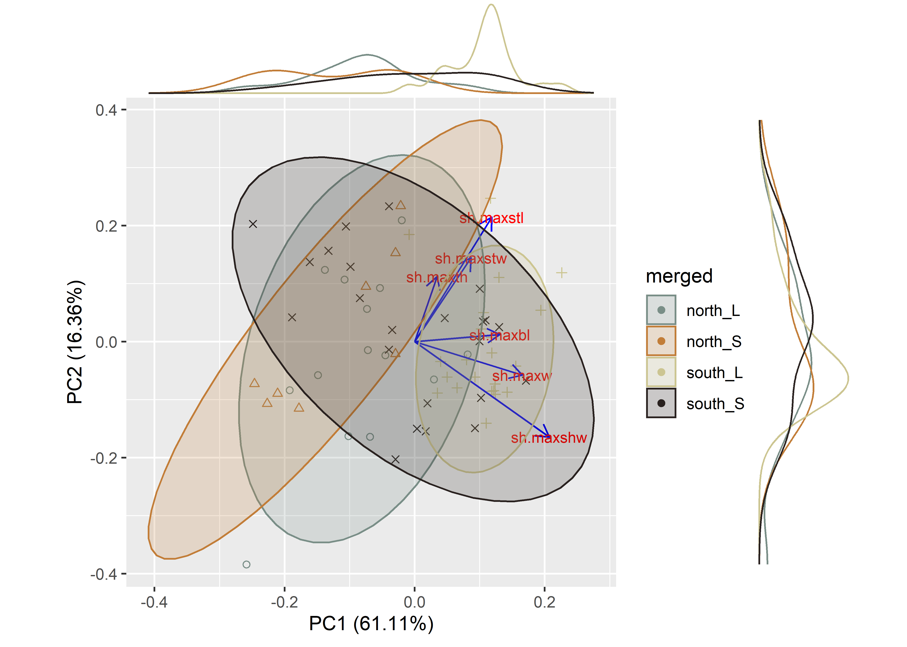
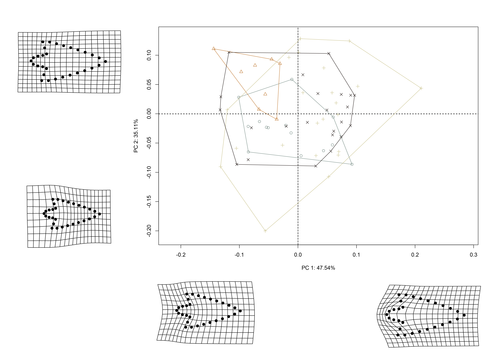
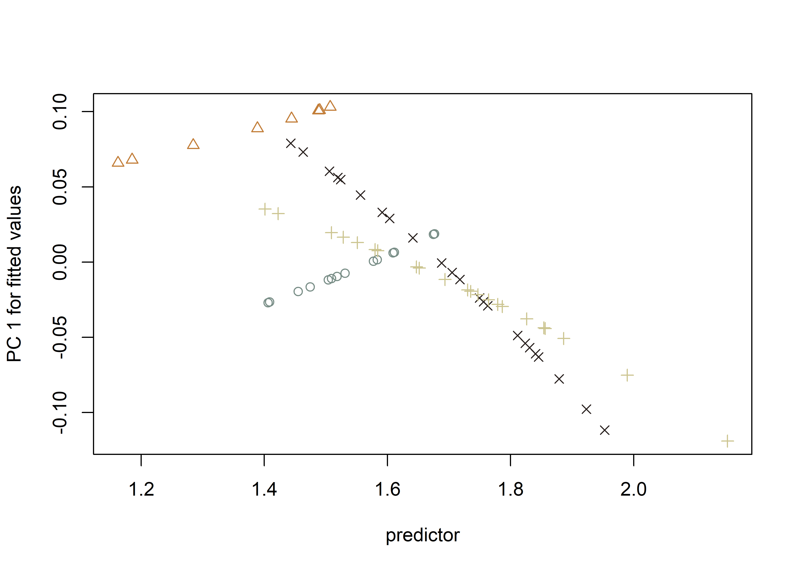

--- 
title: "Morphologically similar, but regionally distinct: Perdiz arrow points from Caddo burial contexts in the American Southeast"
author:
    - Robert Z. Selden, Jr.^[Heritage Research Center, Stephen F. Austin State University; Department of Biology, Stephen F. Austin State University; and Cultural Heritage Department, Jean Monnet University, zselden@sfasu.edu]
date: "`r Sys.Date()`"
site: bookdown::bookdown_site
documentclass: book
bibliography: [book.bib, packages.bib]
url: http://seldenlab.github.io/perdiz.4
cover-image: img/img2/trajectory.png
description: |
  Morphological trajectories and disparity associated with resharpening.
link-citations: yes
github-repo: seldenlab/perdiz.4
---

# Preface {-}

>If you describe something with great accuracy, you describe it as closely as you can to what it is, to its true value. If you describe something with great precision, you do so in the greatest possible detail, even though that detail may not necessarily be the true value of the thing being described. **Simon Winchester, _The Perfectionists: How Precision Engineers Created the Modern World_**

Generally considered diagnostic of Late Prehistoric Toyah assemblages, Perdiz arrow points are characteristic of the transition from the Late Prehistoric to the Protohistoric. If larger Perdiz arrow points from Caddo burials are conceived of as products of trade and/or exchange with Toyah groups, then those with longer blade lengths provide inference to shifts in Caddo selective preference, while those with shorter blade lengths evince local approaches to resharpening and/or retouch that were uniquely Caddo. This study asks whether linear shape variables convey discrete regional resharpening strategies, whether morphological trajectories differ between the northern and southern behavioural regions, and whether morphological disparity differs between larger and smaller size classes, as defined by differences in blade length. Results demonstrate distinct regional resharpening strategies and divergent morphological trajectories for Perdiz arrow points included as Caddo mortuary offerings in the northern and southern behavioural regions. Perdiz arrow point shapes were not found to differ in the large size class between the northern and southern behavioural regions, demonstrating consistency in Caddo preference, or—alternatively—Toyah manufacture. However, differences in the small size class suggest discrete local approaches to resharpening and/or retouch by Caddo knappers. Caddo groups that occupied the southern behavioural region may have also been less selective, preferring Perdiz arrow points with a greater range of diversity in shape and size, while their counterparts to the north preferred a more standardized product.

```{r hypothesis, out.width = "100%", dpi = 300, echo=FALSE, warning=FALSE, fig.cap="Visualization of expectations 1) for Perdiz arrow point trajectories, where (a) morphological disparity in shape (dashed lines) is greater at a larger size (selective preference), and/or (b) morphological disparity in shape is greater at a smaller size (resharpening and/or retouch); where 2) morphological disparity in Perdiz arrow points is expected to be greater where blade length is shorter, due to episodic reduction or retouch; and 3) illustration of Perdiz arrow points offerings included with Caddo burials. "}

```

## Primary findings

```{r MAP, out.width = "100%", dpi = 300, echo=FALSE, warning=FALSE, fig.cap="Location of sites with Perdiz arrow points included in the study, extent of major drainage basins (Neches [brown], Sabine [maroon], and Red [navy] Rivers), and extent of the ancestral Caddo region (white). In the context of this effort, those sites from the Red River basin (navy) constitute the `northern behavioural region`, while those from the Sabine (maroon) and Neches (brown) River basins represent the `southern behavioural region`."}
knitr::include_graphics('img/img2/sca.jpg')
```

### Linear metrics

For this effort, the mean `maximum blade length` for Perdiz arrow points from each behavioural region was calculated and used to bin the sample into two groups (henceforth, `size classes`); one with a longer blade, and the other, shorter. Following the assignment of `size classes`, data were joined in advance of analysis. 

The morphological form (shape + size) of the Perdiz arrow points was then split into `shape` (representing proportions between dimensions in an object) and `size` (sensu Klingenberg [-@RN11105]). `Size` and `shape` were calculated using the method of log-shape ratios proposed by Mosimann [-@RN11104], where the `geometric mean` is considered a proxy for size, and shape was calculated as the log of isometric size subtracted from the log of each linear/dimensional measure.

An ANOVA was subsequently used to assess `shape` as a function of `size class`.

```{r boxlg, out.width = "100%", dpi = 300, echo=TRUE, warning=FALSE, fig.cap="Boxplot by size class."}
## boxplots by size class
knitr::include_graphics('img/boxplot-linear.png')
```

```{r linpca, out.width = "100%", dpi = 300, echo=TRUE, warning=FALSE, fig.cap="PCA by size class."}
## pca by size class

```

#### Results

  - Blade length **differs significantly** between large and small Perdiz arrow point `size classes` in the northern and southern behavioural regions
  - Shoulder width **differs significantly** between large and small Perdiz arrow point `size classes` in the southern behavioural region, but **does not differ** in the northern behavioural region
  - Width **differs significantly** between large and small Perdiz arrow point `size classes` in the southern behavioural region, but **does not differ** in the northern behavioural region
  - Thickness **does not differ** between large and small Perdiz arrow point `size classes` from either behavioural region
  - Stem length **does not differ** between large and small Perdiz arrow point `size classes` from either behavioural region
  - Stem width **does not differ** between large and small Perdiz arrow point `size classes` from either behavioural region

```{r linresharp, out.width = "100%", dpi = 300, echo=TRUE, warning=FALSE, fig.cap="Conceptual rendering of differences found to occur between Perdiz arrow point resharpening trajectories in the a, northern;  and b, southern behavioural regions. In both cases, attributes associated with hafting---`maximum stem length` and `stem width`---are morphologically stable. However, differential approaches to resharpening and/or retouch resulted in distinct shape differences in Perdiz arrow point blades. Resharpening and/or retouch efforts of Caddo knappers from the northern behavioural region was limited to `maximum blade length`, while those from the southern behavioural region were found to be more dynamic, including changes in `maximum blade length`, `width`, and `shoulder width` that occur between `size classes`."}
## resharpening

```

### Geometric morphometrics

This analysis follows recent geometric morphometric analyses of Perdiz arrow points ([Selden and Dockall, in review](https://github.com/seldenlab/perdiz3/blob/main/ms/perdiz3/perdiz3.pdf)) and Gahagan biface morphology across the southern Caddo area and central Texas [@RN11783;@RN21001], where Perdiz arrow points and Gahagan bifaces have been found to differ in shape across the same geography as Caddo bottles [@RN11801;@RN11782;@RN11716;@RN8312].

It also follows a recent geometric morphometric analysis in which Perdiz arrow points from the ancestral Caddo area were found to differ as a function of time, raw material, and burial context [@RN9551;@RN8980].

Landmark data were aligned to a global coordinate system [@RN11622;@RN11623;@RN11563], achieved through generalized Procrustes superimposition [@RN478] performed in R 4.1.3 [@R] using the `geomorph` library v. 4.0.3 [@RN11530;@RN1774;@RN9565]. Procrustes superimposition translates, scales, and rotates the coordinate data to allow for comparisons among objects [@RN11564;@RN478]. The `geomorph` package uses a partial Procrustes superimposition that projects the aligned specimens into tangent space subsequent to alignment in preparation for the use of multivariate methods that assume linear space [@RN1646;@RN11563]. 

Principal components analysis [@RN1746] was used to visualise shape variation among the Perdiz arrow points. The shape changes described by each principal axis are commonly visualized using thin-plate spline warping of a reference 3D mesh [@RN1731;@RN479].

```{r gmpca, out.width = "100%", dpi = 300, echo=TRUE, warning=FALSE, fig.cap="PCA by size class, illustrating variability associated with basal morphology in PC1, and variability associated with blade morphology in PC2."}
## pca

```

To assess whether shape changes with size (allometry) or differs by size class, Procrustes ANOVAs [@RN1749] were run that enlist effect-sizes (zscores) computed as standard deviates of the generated sampling distributions [@RN8446]. A residual randomization permutation procedure (RRPP; n = 10,000 permutations) was used for all Procrustes ANOVAs [@RN1655;@RN11775], which has higher statistical power and a greater ability to identify patterns in the data should they be present [@RN1719]. These results are detailed in Chapter 2.

```{r allometry, out.width = "100%", dpi = 300, echo=TRUE, warning=FALSE, fig.cap="The homogeneity of slopes test indicates that the slopes associated with large and small Perdiz arrow points from the northern and southern behavioural regions differ. This figure plots the first principal component of _predicted_ values versus _size_ as a stylized graphic of the allometric trend. "}
## allometric (shape + size) trajectories by size class

```

A phenotypic trajectory analysis [@RN8344;@RN8550;@RN8569;@RN8533;@RN8446] was used to assess whether Caddo reduction or retouch trajectories differ between the northern and southern behavioural regions. The trajectory analysis was followed by an analysis of morphological disparity [@RN11107;@RN7041;@RN5694] to identify potential differences in morphological diversity between size classes.

```{r trajectory, out.width = "100%", dpi = 300, echo=TRUE, warning=FALSE, fig.cap="Visualization of two shape trajectories for Perdiz arrow points (large/small) that occur in the northern and southern behavioural regions. Shape trajectories are projected onto the first two principal components of between-group shape variation (based on covariance matrix of group means). Trajectories are shown as lines, where the northern behavioural region is represented by squares, and the southern behavioural region by triangles. Transformations are added to facilitate an understanding of shape differences corresponding to large and small Perdiz arrow point shapes from each behavioural region."}
## Perdiz arrow point shape trajectories by size class
knitr::include_graphics('img/img2/trajectory.png')
```

#### Results

  - Perdiz arrow point shape **differs significantly** between the large and small size classes in the northern behavioural region
  - Perdiz arrow point shape **differs significantly** in the small size class between the northern and southern behavioural regions
  - Perdiz arrow point size **differs significantly** in the large size class between the northern and southern behavioural regions
  - Perdiz arrow point size **differs significantly** in the small size class between the northern and southern behavioural regions
  - Allometry is **significant**, and the homogeneity of slopes test indicates that the slopes associated with large and small Perdiz arrow points from the northern and southern behavioural regions differ
  - Modularity is **significant**
  - Morphological integration is **significant**
  - Results of the trajectory analysis demonstrate a **significant difference** between shape trajectories in the northern and southern behavioural regions
  - Results of the morphological disparity analysis by _shape_ demonstrate that the large Perdiz arrow points from the southern behavioural region occupy a **significantly greater** range of morphospace than the large and small Perdiz arrow points from the northern behavioural region
  - Results of the morphological disparity analysis by _size_ demonstrate that the large Perdiz arrow points from the southern behavioural region occupy a **significantly greater** range of morphospace than the large Perdiz arrow points in the northern behavioural region

## Acknowledgments

I extend my gratitude to the Caddo Nation of Oklahoma, the Caddo Nation Tribal Council, Tribal Chairman, and Tribal Historic Preservation Office for their guidance related to the development of the scanning protocols, for permission and access to NAGPRA and previously repatriated collections, and for frank discussions related to language surrounding burial contexts associated with Caddo children. Thanks also to the Anthropology and Archaeology Laboratory at Stephen F. Austin State University for the requisite permissions and access to the NAGPRA items from the Washington Square Mound site and Turner collection, and to Tom A. Middlebrook for brokering access to the Perdiz arrow points from Caddo burials at the Morse Mound site. Thanks also to John E. Dockall, Michael J. Shott, Lauren N. Butaric, David K. Thulman, Timothy K. Perttula, Jon C. Lohse, C. Britt Bousman, Jeffrey S. Girard, Hiram F. (Pete) Gregory, Thomas R. Hester, Harry J. Shafer, Elton R. Prewitt, Bonnie L. Etter, Kersten Bergstrom, Christian S. Hoggard, Emma Sherratt, Dean C. Adams, and Michael L. Collyer for their constructive criticisms, comments, and suggestions throughout the development of this research program, and to the editors and anonymous reviewers for their comments and constructive criticisms, which further improved the manuscript.

## Funding

Components of the analytical workflow were developed and funded by a Preservation Technology and Training grant (P14AP00138) to RZS from the National Center for Preservation Technology and Training, as well as grants to RZS from the Caddo Nation of Oklahoma, National Forests and Grasslands in Texas (15-PA-11081300-033) and the United States Forest Service (20-PA-11081300-074). Additional support for this project was provided by the Heritage Research Center at Stephen F. Austin State University.

## Data management

The data and analysis code associated with this project can be accessed through this document or the [GitHub](https://seldenlab.github.io/perdiz.4/) repository, and is digitally curated on the Open Science Framework ([DOI 10.17605/OSF.IO/85BU7](https://osf.io/85bu7/)). Images and additional information for all Perdiz arrow points used in this study can be viewed and downloaded from the digital comparative collection [https://scholarworks.sfasu.edu/ita-perdiz/](https://scholarworks.sfasu.edu/ita-perdiz/). The replicable nature of this undertaking provides a means for others to critically assess and evaluate the various analytical components of this study [@RN20915;@RN20916;@RN20917], which is a necessary requirement for the production of reliable knowledge.

Reproducibility projects in [psychology](https://osf.io/ezcuj/) and [cancer biology](https://www.cos.io/rpcb) are impacting current research practices across all domains. Examples of reproducible research are becoming more abundant in archaeology [@RN20804;@RN21009;@RN21001], and the next generation of archaeologists are learning those tools and methods needed to reproduce and/or replicate research results [@RN21007]. Reproducible and replicable research work flows are often employed at the highest levels of humanities-based inquiries to mitigate concern or doubt regarding proper execution, and is of particular import should the results have—explicitly or implicitly—a major impact on scientific progress [@RN21008].

## Colophon

This version of the analysis was generated on `r Sys.time()` using the following computational environment and dependencies: 

```{r colophon, cache = FALSE}
# what R packages and versions were used?
if ("devtools" %in% installed.packages()) devtools::session_info()
```

Current Git commit details are:

```{r}
# where can I find this commit? 
if ("git2r" %in% installed.packages() & git2r::in_repository(path = ".")) git2r::repository(here::here())  
```

```{r include=FALSE}
# automatically create a bib database for R packages
knitr::write_bib(c(
  .packages(), 'bookdown', 'knitr', 'rmarkdown'
), 'packages.bib')
```
